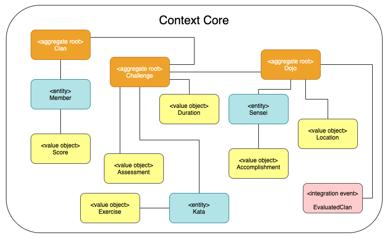
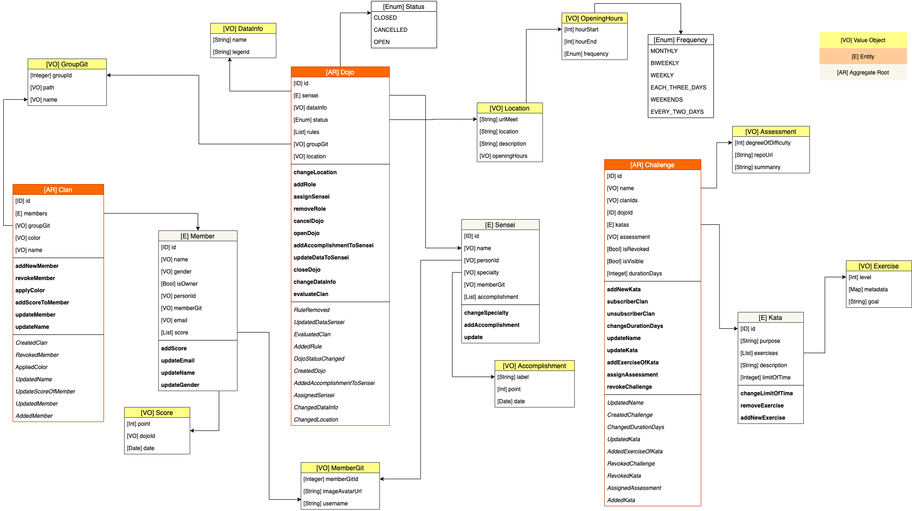

# CHALLENGE - TRAINING DDD #

## Summary ##

Vamos a realizar un reto donde se mida los conocimientos técnicos de DDD, donde vamos a realizar una propuesta táctica a una solución de un caso particular, donde del reto se deberás aplicar todos los conceptos táctico como; agregados, servicios, objetos de valor, entidades, casos de uso, comandos y eventos.

Además tener en cuenta los aspectos de calidad como las pruebas unitarias (ver los criterios del reto).

Evaluar el Context Core que deben desarrollar:

## Challenge Case

Se tiene el siguiente modelo de dominio diseñado con DDD, donde se implementa una solución del diseño anterior:

**Nota: algunos de los objetos de valor son asumidos en el modelo de dominio, se puede asumir sus atrubutos del objeto como tal.**

### Realizar los siguientes casos de usos:
1. Crear un nuevo Dojo y por defecto debe estar cerrado, al crear el dojo se debe tambien asignar el sensei
2. Agregar reglas al dojo
3. Cambiar la URL del meet dentro de la licalización del Dojo
4. Crear un nuevo Clan, al crear el clan se debe crear el miembro principal (isOwere = true) y ademas se debe aplicar un color por defecto (Blanco)
5. Agregar un nuevo miembro al clan
6. Actualizar los puntajes del miembro, a través de un evento de dominio que llegaria del Dojo
7. Crear un Challenge (se debe tener el id del dojo)
8. Subscribir un clan
9. Agregar katas al challenge
10. Agregar ejercicio a la kata
11. Eliminar un ejercicio de la kata
12. Evaluar clan basados en un challenge id

## Evaluation criteria ##

| Criteria                                                                                              | Percentage |
| ----------------------------------------------------------------------------------------------------- | ---------- |
| Tener una cobertura de código de 100% para el modelo de dominio y para los casos de uso               | 20.0 %     |
| Desarrollar todos los casos de uso descritos dentro del desafío                                       | 20.0 %     |
| Sustentación de la propuesta técnica desarrollada (10 minutos)                                        | 40.0 %     |
| Aplicar correctamente los conceptos de agregado, eventos, entidades, objeto de valor y casos de usos. | 20.0 %     |

> Recordar que el reto se pasa con un 70% de su evaluación final.
